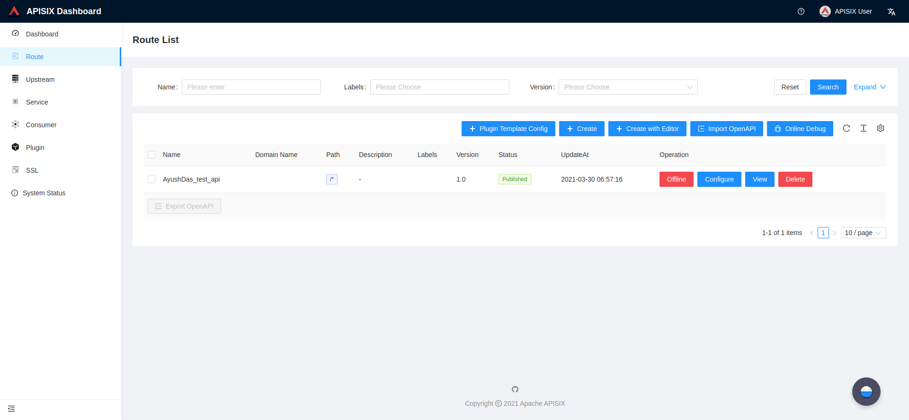

# APISix

本页最后更新时间: {docsify-updated}

## 简介



## EXPOSE

| 端口 | 用途 |
| :--- | :--- |
| 9080 | HTTP API端口 |
| 9443 | HTTPS API端口 |


## 启动命令

<!-- tabs:start -->
#### **Docker**
```bash
docker run -d \
--network=backend \
--restart unless-stopped \
-e TZ=Asia/Shanghai \
--name apisix
-e TZ=Asia/Shanghai \
-v ${NFS}/apisix/apisix/config.yaml:/usr/local/apisix/conf/config.yaml 
-p 9080:9080 \
apache/apisix:2.6-alpine
```


#### **Swarm**
```bash
docker service create --replicas 1 \
--name apisix \
--network staging \
-e TZ=Asia/Shanghai \
-p 9080:9080 \
-p 9443:9443 \
--mount type=bind,src=${NFS}/apisix/config.yaml,dst=/usr/local/apisix/conf/config.yaml \
apache/apisix:2.6-alpine
```

<!-- tabs:end -->


## 参考

