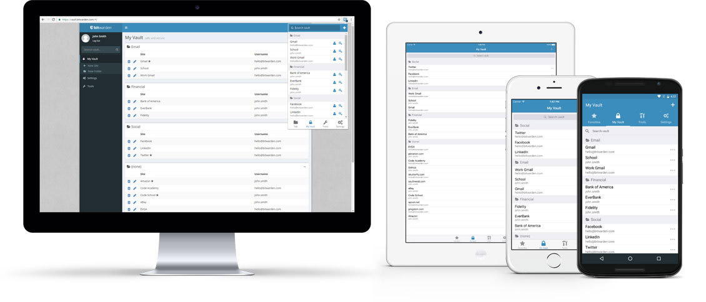

# Vaultwarden

文档最后更新时间: {docsify-updated}

## 简介



Vaultwarden(原名:Bitwarden_RS)是Bitwarden(开源密码管理器)的另一种开源实现，此项目由社区维护，完全汉化并兼容上游Bitwarden接口，支持多种Bitwarden浏览器插件与 iOS、Android 客户端，2FA以及组织功能。

相较于部署Bitwarden需要启动7个镜像并占用2G内存，Vaultwarden仅一个镜像，内存占用也仅8M出头。

目前Vaultwarden在功能上仅缺少Bitwarden企业版的部分功能(公共API、SSO、群组、自定义角色)

个人用户推荐直接使用Bitwarden官网免费服务即可，无需架设服务器。

## EXPOSE

| 端口 | 用途 |
| :--- | :--- |
| 80 | Web入口 |
| 3012 | WebSocket端口 |


## 前置准备

```bash
mkdir ${NFS}/bitwarden
chmod -R 755 /${NFS}/bitwarden
```

  

## 启动命令

<!-- tabs:start -->

#### **Swarm**

```bash
docker service create --replicas 1 \
--name bitwardenrs \
--network staging \
-e TZ=Asia/Shanghai \
--mount type=bind,src=${NFS}/bitwarden,dst=/data \
-e SIGNUPS_ALLOWED=true \
-e INVITATIONS_ALLOWED=true \
-e WEBSOCKET_ENABLED=true \
-e WEB_VAULT_ENABLED=true \
-e EMERGENCY_ACCESS_ALLOWED=false \
-e DOMAIN=https://pwd.${DOMAIN} \
-e LOG_FILE=/data/bitwarden.log \
-e LOG_LEVEL=error \
-e EXTENDED_LOGGING=true \
-e ADMIN_TOKEN=Aj43jUOZb908JLYbh7giDRv6TqkMFflIY+ebrSQ8phvR7kY+jFDt9yThorconuWU \
vaultwarden/server:1.23.0

#traefik参数
--label traefik.enable=true \
--label traefik.docker.network=staging \
# bitwarden-ui
--label traefik.http.middlewares.redirect-https.redirectScheme.scheme=https \
--label traefik.http.middlewares.redirect-https.redirectScheme.permanent=true \
--label traefik.http.routers.bitwarden-ui-http.service=bitwarden-ui \
--label traefik.http.services.bitwarden-ui.loadbalancer.server.port=80 \
--label traefik.http.routers.bitwarden-ui-http.rule="Host(\`pwd.${DOMAIN}\`)" \
--label traefik.http.routers.bitwarden-ui-http.entrypoints=http \
--label traefik.http.routers.bitwarden-ui-http.middlewares=redirect-https \
--label traefik.http.routers.bitwarden-ui-https.rule="Host(\`pwd.${DOMAIN}\`)" \
--label traefik.http.routers.bitwarden-ui-https.entrypoints=https \
--label traefik.http.routers.bitwarden-ui-https.tls=true \
--label traefik.http.routers.bitwarden-ui-https.tls.certresolver=dnsResolver \
--label traefik.http.routers.bitwarden-ui-https.service=bitwarden-ui \
# bitwarden-websocket
--label traefik.http.routers.bitwarden-websocket-http.service=bitwarden-websocket \
--label traefik.http.services.bitwarden-websocket.loadbalancer.server.port=3012 \
--label traefik.http.routers.bitwarden-websocket-http.rule="Host(\`pwd.${DOMAIN}\`) && Path(\`/notifications/hub\`)" \
--label traefik.http.routers.bitwarden-websocket-http.entrypoints=http \
--label traefik.http.routers.bitwarden-websocket-http.middlewares=redirect-https \
--label traefik.http.routers.bitwarden-websocket-https.rule="Host(\`pwd.${DOMAIN}\`) && Path(\`/notifications/hub\`)" \
--label traefik.http.routers.bitwarden-websocket-https.entrypoints=https \
--label traefik.http.routers.bitwarden-websocket-https.tls=true \
--label traefik.http.routers.bitwarden-websocket-https.service=bitwarden-websocket \
--label traefik.http.routers.bitwarden-websocket-https.tls.certresolver=dnsResolver \
```


#### **Compose**

```yaml
version: "3.5"

services:
  bitwardenrs:
    image: vaultwarden/server
    container_name: bitwardenrs
    security_opt:
      - no-new-privileges:true
    ports:
      - "127.0.0.1:8000:80"
      - "127.0.0.1:3012:3012"
    environment:
      - SIGNUPS_ALLOWED=true
      - INVITATIONS_ALLOWED=true
      - WEBSOCKET_ENABLED=true
      - WEB_VAULT_ENABLED=true
      - EMERGENCY_ACCESS_ALLOWED=false
      - DOMAIN=https://btwd.example.com
      - LOG_FILE=/data/bitwarden.log
      - LOG_LEVEL=error
      - EXTENDED_LOGGING=true
      - ADMIN_TOKEN=Aj43jUOZb908JLYbh7giDRv6TqkMFflIY+ebrSQ8phvR7kY+jFDt9yThorconuWU
    volumes:
      - ./data:/data
    restart: unless-stopped
    networks:
      - traefik
    labels:
      - traefik.enable=true
      - traefik.docker.network=traefik
      # bitwarden-ui
      - traefik.http.middlewares.redirect-https.redirectScheme.scheme=https
      - traefik.http.middlewares.redirect-https.redirectScheme.permanent=true
      - traefik.http.routers.bitwarden-ui-https.rule=Host(`btwd.${DOMAIN}`)
      - traefik.http.routers.bitwarden-ui-https.entrypoints=https
      - traefik.http.routers.bitwarden-ui-https.tls=true
      - traefik.http.routers.bitwarden-ui-https.tls.certresolver=dnsResolver
      - traefik.http.routers.bitwarden-ui-https.service=bitwarden-ui
      - traefik.http.routers.bitwarden-ui-http.rule=Host(`btwd.${DOMAIN}`)
      - traefik.http.routers.bitwarden-ui-http.entrypoints=http
      - traefik.http.routers.bitwarden-ui-http.middlewares=redirect-https
      - traefik.http.routers.bitwarden-ui-http.service=bitwarden-ui
      - traefik.http.services.bitwarden-ui.loadbalancer.server.port=80
      # bitwarden-websocket
      - traefik.http.routers.bitwarden-websocket-https.rule=Host(`btwd.${DOMAIN}`) && Path(`/notifications/hub`)
      - traefik.http.routers.bitwarden-websocket-https.entrypoints=https
      - traefik.http.routers.bitwarden-websocket-https.tls=true
      - traefik.http.routers.bitwarden-websocket-https.service=bitwarden-websocket
      - traefik.http.routers.bitwarden-websocket-https.tls.certresolver=dnsResolver
      - traefik.http.routers.bitwarden-websocket-http.rule=Host(`btwd.${DOMAIN}`) && Path(`/notifications/hub`)
      - traefik.http.routers.bitwarden-websocket-http.entrypoints=http
      - traefik.http.routers.bitwarden-websocket-http.middlewares=redirect-https
      - traefik.http.routers.bitwarden-websocket-http.service=bitwarden-websocket
      - traefik.http.services.bitwarden-websocket.loadbalancer.server.port=3012

networks:
  traefik:
    external: true

```

<!-- tabs:end -->


## 参考

官网: https://bitwarden.com/
Github: https://github.com/dani-garcia/vaultwarden
反代文档: https://github.com/dani-garcia/vaultwarden/wiki/Proxy-examples
