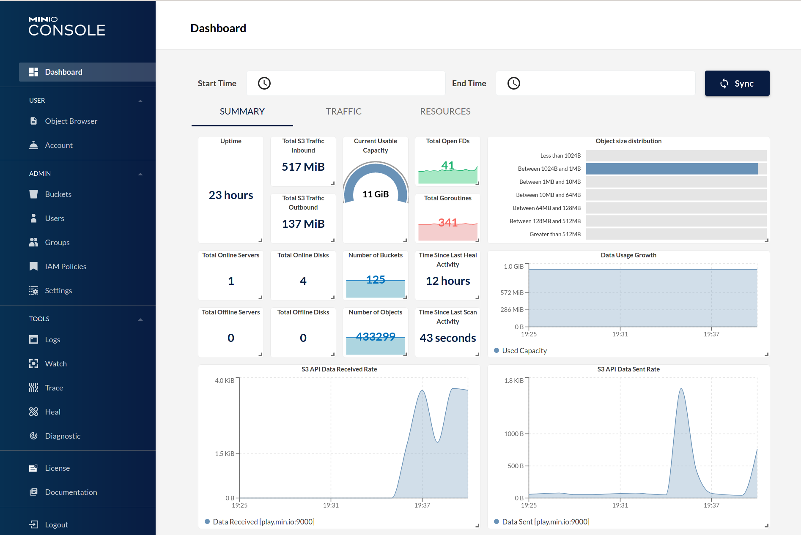

# Minio

文档最后更新时间: {docsify-updated}

[](https://github.com/minio/minio/releases/latest)

## 简介



兼容S3的对象存储服务

## EXPOSE

| 端口 | 用途 |
| :--- | :--- |
| 9000 | API接口 |
| 42311 | 管理页面 |


## 前置准备

```bash
#创建数据保存目录
mkdir -p ${NFS}/minio/data
mkdir ${NFS}/minio/conf
chmod 775 ${NFS}/minio/data
```

## 启动命令

<!-- tabs:start -->
#### **Docker**
```bash
docker run -d \
--name minio \
--restart unless-stopped \
--network=backend \
-e TZ=Asia/Shanghai \
-e "MINIO_PROMETHEUS_AUTH_TYPE=public" \
-e "MINIO_REGION_NAME=Area1" \
-e "MINIO_BROWSER=on" \
-e "MINIO_ROOT_USER=minioadmin" \
-e "MINIO_ROOT_PASSWORD=wJalrXUtnFEMI/K7MD8NG/bPxRfiBY7XAMPLEKEY" \
-e "MINIO_SERVER_URL=http://minio.${DOMAIN}:9000" \
-v ${NFS}/minio/data:/data \
-v ${NFS}/minio/conf:/root/.minio \
-p 9000:9000 \
-p 42311:42311 \
minio/minio server /data --console-address ":42311"
```


#### **Swarm**
```bash
docker service create --replicas 1 \
--name minio \
--network staging \
-e TZ=Asia/Shanghai \
-e "MINIO_PROMETHEUS_AUTH_TYPE=public" \
-e "MINIO_REGION_NAME=Area1" \
-e "MINIO_BROWSER=on" \
-e "MINIO_ROOT_USER=minioadmin" \
-e "MINIO_ROOT_PASSWORD=wJalrXUtnFEMI/K7MD8NG/bPxRfiBY7XAMPLEKEY" \
-e "MINIO_SERVER_URL=http://minio.${DOMAIN}:9000" \
-p 9000:9000 \
-p 42311:42311 \
--mount type=bind,src=${NFS}/minio/data,dst=/data \
--mount type=bind,src=${NFS}/minio/conf,dst=/root/.minio \
minio/minio server /data --console-address ":42311"

#traefik参数
--label traefik.enable=true \
--label traefik.docker.network=staging \
--label traefik.http.services.minio.loadbalancer.server.port=9000 \
--label traefik.http.routers.minio.rule="Host(\`minio.${DOMAIN}\`)" \
--label traefik.http.routers.minio.entrypoints=http \
--label traefik.http.routers.minio-sec.tls=true \
--label traefik.http.routers.minio-sec.tls.certresolver=dnsResolver \
--label traefik.http.routers.minio-sec.rule="Host(\`minio.${DOMAIN}\`)" \
--label traefik.http.routers.minio-sec.entrypoints=https \
```

#### **Compose**

```yaml
version: "3
services:
  minio:
    image: minio/minio
    container_name: minio
    networks: staging
    volumes:
      - ${NFS}/minio/data:/data
      - ${NFS}/minio/conf:/root/.minio
    environment:
      TZ: Asia/Shanghai
      MINIO_PROMETHEUS_AUTH_TYPE:"public"
      MINIO_REGION_NAME: "Area1"
      MINIO_BROWSER: "on"
      MINIO_ROOT_USER: "minioadmin"
      MINIO_ROOT_PASSWORD: "wJalrXUtnFEMI/K7MD8NG/bPxRfiBY7XAMPLEKEY"
      MINIO_SERVER_URL: "http://minio.${DOMAIN}:9000"
    labels: 
      - traefik.enable: true
      - traefik.docker.network: staging
      - traefik.http.services.minio.loadbalancer.server.port: 9000
      - traefik.http.routers.minio.rule: "Host(\`minio.${DOMAIN}\`)"
      - traefik.http.routers.minio.entrypoints: http
      - traefik.http.routers.minio-sec.tls: true
      - traefik.http.routers.minio-sec.tls.certresolver: dnsResolver
      - traefik.http.routers.minio-sec.rule: "Host(\`minio.${DOMAIN}\`)"
      - traefik.http.routers.minio-sec.entrypoints: https
    logging: 
      driver: loki
      options: 
        -loki-url: "http://loki:3100/api/prom/push
    restart: unless-stopped
    command: "minio server /data  --console-address \":42311\""
```
<!-- tabs:end -->


## 参考

官网: [https://min.io/](https://min.io/)  
DockerHub: [https://hub.docker.com/r/minio/minio](https://hub.docker.com/r/minio/minio)  
中文帮助: [http://docs.minio.org.cn/docs/](http://docs.minio.org.cn/docs/)  
参考手册: [https://docs.min.io/cn/minio-quickstart-guide.html](https://docs.min.io/cn/minio-quickstart-guide.html)
监控面板: [how-to-monitor-minio-using-prometheus](http://docs.minio.org.cn/docs/master/how-to-monitor-minio-using-prometheus)

