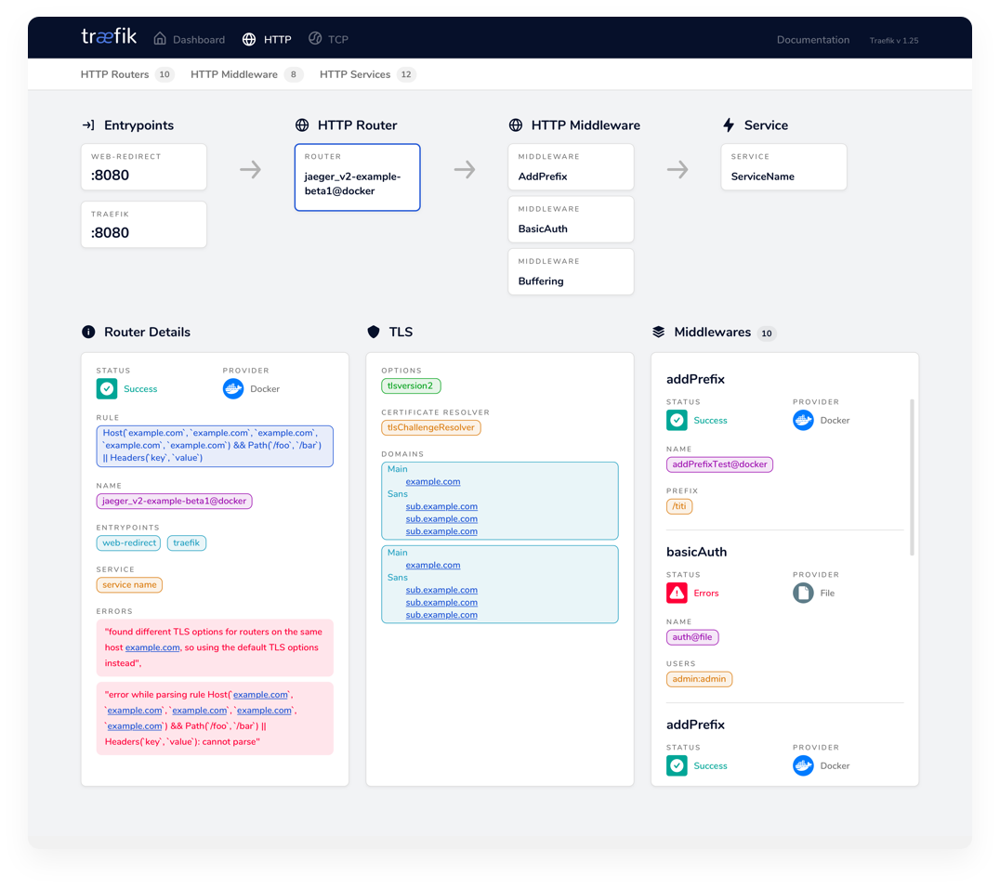

# Traefik

本页最后更新时间: {docsify-updated}

## 简介

开源云原生网关



## EXPOSE

| 端口   | 用途    |
| ---- | ----- |
| 8080 | 管理页面  |
| 80   | HTTP  |
| 443  | HTTPS |


## 前置准备

```bash
#创建数据保存目录
mkdir -p ${NFS}/traefik/config
```

```yaml
# traefik.toml

################################################################
# 全局配置文件
################################################################
[global]
  checkNewVersion = false
  sendAnonymousUsage = false

[log]
  level = "WARN"
  
[metrics]
  [metrics.prometheus]
    buckets = [0.1,0.3,1.2,5.0]
  [entryPoints.metrics]
    address = ":8082"

[tracing]
  [tracing.jaeger]
     [tracing.jaeger.collector]
        endpoint = "http://tempo:14268/api/traces?format=jaeger.thrift"

[serversTransport]
	insecureSkipVerify = true

[entryPoints]
  [entryPoints.http]
    address = ":80"
    [entryPoints.http.forwardedHeaders]
      insecure = true
  [entryPoints.https]
    address = ":443"
    [entryPoints.https.forwardedHeaders]
      insecure = true

  [entryPoints.ssh]
    address = ":8022"

[api]
  dashboard = true
  insecure = true

[ping]

[accessLog]

################################################################
# Docker 后端配置
################################################################
[providers]
  [providers.docker]
    endpoint = "unix:///var/run/docker.sock"
    #defaultRule = "Host(`{{ normalize .Name }}.docker.localhost`)"
    watch = true
    #exposedByDefault = false
    useBindPortIP = false
    swarmMode = true
    network = "staging"
  [providers.file]
    watch = true
    directory = "/etc/traefik/config"
    debugLogGeneratedTemplate = true

################################################################
# ACME (Let's Encrypt) 配置
################################################################
[certificatesResolvers.dnsResolver.acme]
  email = "rakutens@hotmail.com"
  storage = "/etc/traefik/acme.json"
# CA server to use.
# Uncomment the line to use Let's Encrypt's staging server,
# leave commented to go to prod.
#
# Optional
# Default: "https://acme-v02.api.letsencrypt.org/directory"
#
#	caServer = "https://acme-staging-v02.api.letsencrypt.org/directory"
  [certificatesResolvers.dnsResolver.acme.dnsChallenge]
    provider = "alidns"
    resolvers = ["223.5.5.5:53", "114.114.114.114:53"]

```

## 启动命令

<!-- tabs:start -->
#### **Docker**


```bash
docker run -d \
--network=backend \
--restart unless-stopped \
-e TZ=Asia/Shanghai \
--name traefik \
--privileged \
-p 8080:8080 -p 82:80 -p 444:443 \
-v ${NFS}/traefik/traefik.toml:/etc/traefik/traefik.toml \
-v ${NFS}/traefik/acme:/etc/traefik/acme \
-v /var/run/docker.sock:/var/run/docker.sock \
traefik
```


#### **Swarm**
```bash
docker service create --replicas 1 \
--name traefik \
--network staging \
-p 8080:8080 \
-p 80:80 -p 443:443 \
--constraint=node.role==manager \
--secret ali_access \
--secret ali_secret \
-e ALICLOUD_ACCESS_KEY_FILE=/run/secrets/ali_access \
-e ALICLOUD_SECRET_KEY_FILE=/run/secrets/ali_secret \
-e TZ=Asia/Shanghai \
--mount type=bind,source=/var/run/docker.sock,target=/var/run/docker.sock \
--mount type=bind,source=${NFS}/traefik,target=/etc/traefik \
--mount type=bind,source=${NFS}/traefik/config,target=/etc/traefik/config,readonly \
traefik
```


#### **Compose**

```yaml
version: "3"
secrets: 
  ali_access: 
    external: true
  ali_secret: 
    external: true
    
services: 
  traefik: 
    image: traefik
    container_name: traefik
    networks: staging
    expose:
      - 80
      - 443
      - 8080
    secrets: 
      - ali_access
      - ali_secret
    environment: 
      TZ: Asia/Shanghai
      ALICLOUD_ACCESS_KEY_FILE: /run/secrets/ali_access
      ALICLOUD_SECRET_KEY_FILE: /run/secrets/ali_secret
    volumes: 
      - /var/run/docker.sock:/var/run/docker.sock
      - ${NFS}/traefik:/etc/traefik
      - ${NFS}/traefik/config: /etc/traefik/config,z
    logging: 
      driver: loki
      options: 
        -loki-url: "http://loki:3100/api/prom/push
    restart: unless-stopped
```


<!-- tabs:end -->

## 匹配规则

```
Path: /sub/             匹配请求的子目录
PathPrefix: /sub/*      匹配请求的子目录及包含该子目录的请求
```

## 参考

官 网:[https://traefik.io](https://traefik.io)

DockerHub:[https://hub.docker.com/\_/traefik](https://hub.docker.com/\_/traefik)

中文文档:[https://www.geek-book.com/src/docs/traefik/traefik/docs.traefik.io/index.html](https://www.geek-book.com/src/docs/traefik/traefik/docs.traefik.io/index.html)
