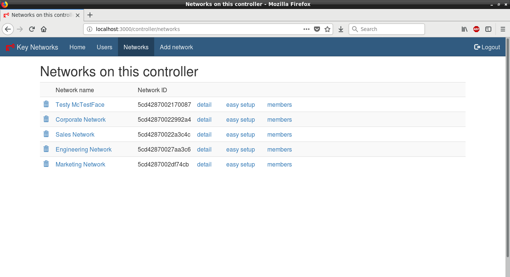

# ZeroTier

本页最后更新时间: {docsify-updated}

## 简介



端到端加密的去中心化VPN，可用于组建超大形加密局域网

名词解释

> Controller  控制台界面，可选用[官网控制台](https://my.zerotier.com/)或自架[ztncui](https://github.com/key-networks/ztncui)  
> PLANET 行星服务器，Zerotier 根服务器   
> MOON 卫星服务器，用户自建的私有根服务器，起到代理加速的作用   
> LEAF 网络客户端，也就是每台需连到服务器的客户端

安装使用方式有三种搭配

1. 安装客户端+使用官方PLANET服务器+官方控制界面 = 无需公网服务器
2. 安装客户端+自架MOON服务器+官方控制界面 = 性能更好无需维护控制台
3. 安装客户端+自架MOON服务器+自架控制界面 = 全自建

## EXPOSE

| 端口 | 用途 |
| :--- | :--- |
| 9993 | 服务器通讯端口 |


## 启动命令

<!-- tabs:start -->
#### **Docker**
```bash
docker run -d \
--network=backend \
--restart unless-stopped \
-e TZ=Asia/Shanghai \
--name moon \
-p 9993:9993/udp \
-v $NFS/zerotier-moon:/var/lib/zerotier-one \
seedgou/zerotier-moon \
-4 服务器IPV4公网IP \
-6 服务器IPV6公网IP
```


#### **Swarm**


<!-- tabs:end -->


IPV4或IPV6至少需要设定一个


* 查看moon id\(节点地址号\)并保留zerotier-cli命令及参数备用

```bash
docker logs moon
```

* 下载客户端并安装至客户机
* 在客户机运行保留的zerotier-cli命令增加服务器

```bash
zerotier-cli orbit {moon id} {moon id}
```

* 在[官网控制台](https://my.zerotier.com/)注册一个帐号，创建网络\(可能已创建好\)，保留Network ID备用
* 在客户机加入网络

```bash
zerotier-cli join {Network ID}
```

* 在官网控制台网络详情页面 ,勾先\[Auth?\]项批准新加入的客户端

## 参考

使用教程: [https://www.hi-linux.com/posts/33914.html](https://www.hi-linux.com/posts/33914.html)

