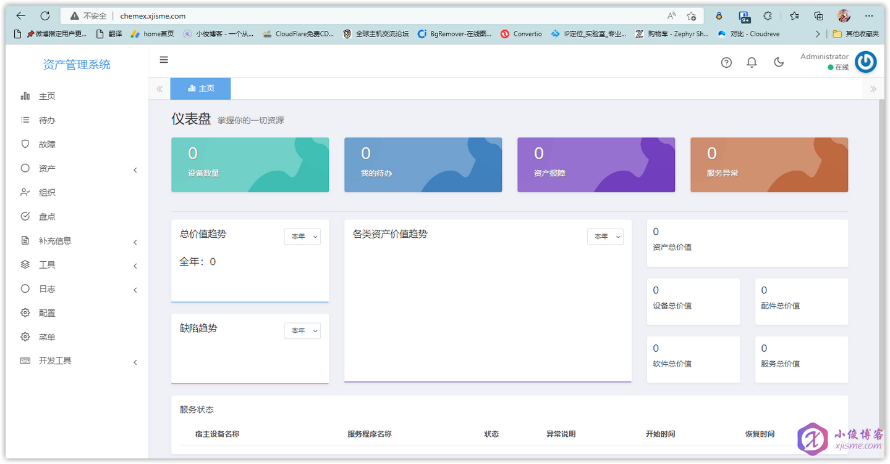

# CAT

本页最后更新时间: {docsify-updated}

[](https://github.com/celaraze/cat/releases/latest)

## 简介



专为 IT 运维从业者打造的一站式解决方案平台，包含资产管理、工单、工作流、仓储等功能


## EXPOSE

| 端口 | 用途 |
| :--- | :--- |
| 8000 | 管理页面 |


## 前置准备

```bash
mkdir -p $NFS/cat/data
mkdir $NFS/cat/public
chmod 766 $NFS/cat/data
chmod 766 $NFS/cat/public

# 先运行一次生成基础文件
docker run -itd \
--name cat \
-v $NFS/cat/data:/var/www/database/data \
-v $NFS/cat/public:/var/www/storage/app/public \
celaraze/cat:1.0.5

docker exec -it cat /bin/bash
php artisan cat:install

# 复制配置文件到宿主机
docker cp cat:/var/www/.env $NFS/cat/env

# 删除容器
docker rm -f cat
```


## 启动命令

<!-- tabs:start -->
#### **Docker**

```bash
docker run -d \
--restart unless-stopped \
--name cat \
--network=backend \
-e TZ=Asia/Shanghai \
-p 8000:8000 \
-v $NFS/cat/data:/var/www/database/data \
-v $NFS/cat/public:/var/www/storage/app/public \
-v $NFS/cat/env:/var/www/.env \
celaraze/cat:1.0.5
```


#### **Swarm**

```bash
docker service create --replicas 1 \
--name cat \
--network staging \
-e TZ=Asia/Shanghai \
-e PHP_TZ=Asia/Shanghai \
--mount type=bind,src=$NFS/cat/data,dst=/var/www/database/data \
--mount type=bind,src=$NFS/cat/public,dst=/var/www/storage/app/public \
--mount type=bind,src=$NFS/cat/env,dst=/var/www/.env \
--label traefik.enable=true \
--label traefik.docker.network=staging \
--label traefik.http.routers.cat.rule="Host(\`cat.${TEST_DOMAIN}\`)" \
--label traefik.http.routers.cat.entrypoints=http \
--label traefik.http.services.cat.loadbalancer.server.port=8000 \
--label traefik.http.routers.cat-sec.tls=true \
--label traefik.http.routers.cat-sec.rule="Host(\`cat.${TEST_DOMAIN}\`)" \
--label traefik.http.routers.cat-sec.entrypoints=https \
celaraze/cat:1.0.5
```

<!-- tabs:end -->


## 参考

官网: 
Github:

