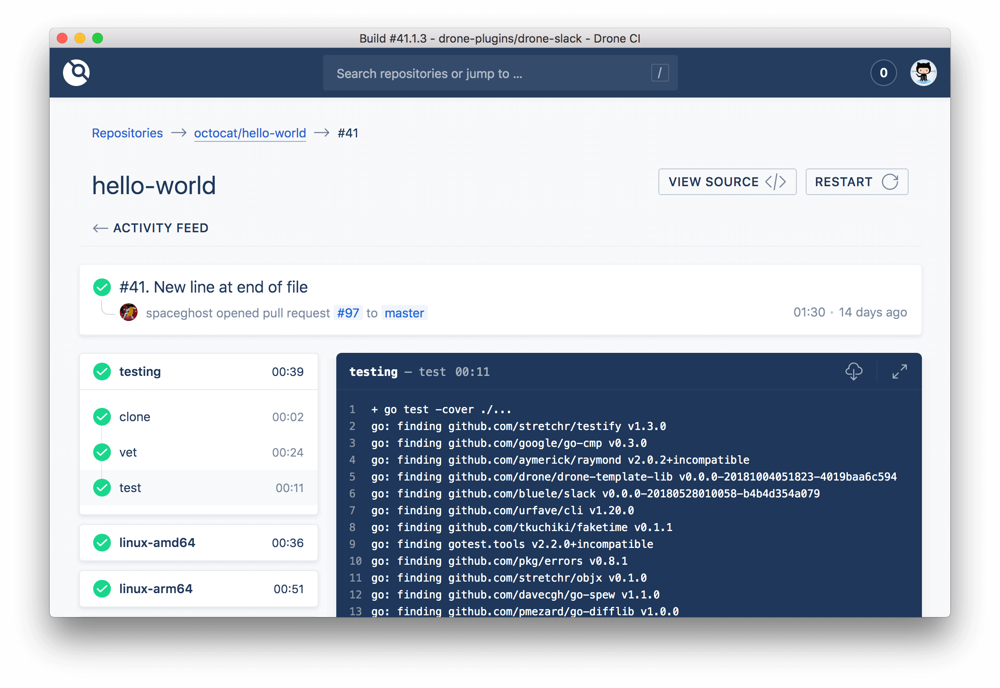

# Drone

本页最后更新时间: {docsify-updated}

[](https://github.com/drone/drone/releases/latest)

## 简介



Drone是一款轻量级的开源的CI/CD工具，我们可以用来搭配Gitea使用，虽然新版的Gitea已有Action功能，但并不支持Windows节点，所以依然比较推荐使用Drone

## EXPOSE

| 端口 | 用途 |
| :--- | :--- |
| 80 | HTTP管理入口 |
| 443 | HTTPS管理入口 |


## 前置准备

```bash
#创建数据保存目录
mkdir ${NFS}/drone
```

编译企业版\(可解除5000次限制\)

- 创建docker build文件

```bash
touch drone.yaml
```

- drone.yaml

```bash

FROM golang:1.16.5-alpine3.14 AS Builder

RUN sed -i 's/https:\/\/dl-cdn.alpinelinux.org/http:\/\/mirrors.tuna.tsinghua.edu.cn/' /etc/apk/repositories && \
    echo "Asia/Shanghai" > /etc/timezone && \
    apk add build-base

ENV DRONE_VERSION 2.20.0

WORKDIR /src

# Build with online code
RUN wget https://download.fastgit.org/drone/drone/archive/refs/tags/v${DRONE_VERSION}.tar.gz -O v${DRONE_VERSION}.tar.gz && \
    tar zxvf v${DRONE_VERSION}.tar.gz && \
    rm v${DRONE_VERSION}.tar.gz
# OR with offline tarball
# ADD drone-2.20.0.tar.gz /src/

WORKDIR /src/drone-${DRONE_VERSION}

# OR with master branches
#RUN wget -L https://github.com/drone/drone/archive/refs/heads/master.tar.gz -o master.tar.gz && \
#    tar zxvf master.tar.gz && \
#    rm master.tar.gz
#WORKDIR /src/drone-master

ENV CGO_CFLAGS="-g -O2 -Wno-return-local-addr"

RUN go env -w GO111MODULE=on && \
    go env -w GOPROXY=https://mirrors.aliyun.com/goproxy/,direct && \
    #go env -w GOPROXY=https://goproxy.cn/,direct && \
    go mod download

RUN go build -ldflags "-extldflags \"-static\"" -tags="nolimit" github.com/drone/drone/cmd/drone-server


FROM alpine:3.14 AS Certs
RUN sed -i 's/https:\/\/dl-cdn.alpinelinux.org/http:\/\/mirrors.tuna.tsinghua.edu.cn/' /etc/apk/repositories && \
    echo "Asia/Shanghai" > /etc/timezone
RUN apk add -U --no-cache ca-certificates


FROM alpine:3.14
EXPOSE 80 443
VOLUME /data

RUN [ ! -e /etc/nsswitch.conf ] && echo 'hosts: files dns' > /etc/nsswitch.conf

ENV GODEBUG netdns=go
ENV XDG_CACHE_HOME /data
ENV DRONE_DATABASE_DRIVER sqlite3
ENV DRONE_DATABASE_DATASOURCE /data/database.sqlite
ENV DRONE_RUNNER_OS=linux
ENV DRONE_RUNNER_ARCH=amd64
ENV DRONE_SERVER_PORT=:80
ENV DRONE_SERVER_HOST=localhost
ENV DRONE_DATADOG_ENABLED=true
ENV DRONE_DATADOG_ENDPOINT=https://stats.drone.ci/api/v1/series

COPY --from=Certs /etc/ssl/certs/ca-certificates.crt /etc/ssl/certs/
COPY --from=Builder /src/drone-2.20.0/drone-server /bin/drone-server
ENTRYPOINT ["/bin/drone-server"]
```

- 生成镜像

```bash
docker build --rm -f drone.yaml -t drone:2.20.0 .
```


## 启动命令

<!-- tabs:start -->
#### **Docker**
```bash
docker run -d \
--name drone \
--restart unless-stopped \
--network=backend \
-e DRONE_AGENTS_ENABLED=true \
-e DRONE_USER_CREATE=rakutens \
-e DRONE_SERVER_HOST=drone.${DOMAIN} \
-e DRONE_SERVER_PROTO=http \
-e DRONE_LOGS_TRACE=true \
-e DRONE_LOGS_DEBUG=true \
-e DRONE_GOGS_SERVER=http://gogs:3000 \
-e DRONE_RPC_SECRET=MWckgvhjqg4E3eQ0ptg2X4iNC6oQiyU4LLvO4eXFFuHtrTkIy2vwcAc3erB5f9reM \
-p 80:80 \
-p 443:443 \
drone:2.20.0
```


#### **Swarm**
```bash
docker service create --replicas 1 \
--name drone \
--network staging \
-e TZ=Asia/Shanghai \
-e DRONE_AGENTS_ENABLED=true \
-e DRONE_DATADOG_ENABLED=false \
-e DRONE_USER_CREATE=username:rakutens,admin:true \
-e DRONE_SERVER_HOST=drone.${DOMAIN} \
-e DRONE_SERVER_PROTO=http \
-e DRONE_LOGS_DEBUG=true \
-e DRONE_GIT_ALWAYS_AUTH=true \
-e DRONE_GIT_USERNAME=drone \
-e DRONE_GIT_PASSWORD=Drone!23 \
-e DRONE_GOGS_SERVER=http://gogs:3000 \
-e DRONE_WEBHOOK_ENDPOINT=http://drone/hook \
-e DRONE_RPC_SECRET=MWckgvhjqg4E3eQ0ptg2X4iNC6oQiyU4LLvO4eXFFuHtrTkIy2vwcAc3erB5f9reM \
--mount type=bind,src=${NFS}/drone,dst=/data \
--mount type=bind,source=/var/run/docker.sock,target=/var/run/docker.sock \
drone:2.20.0

#traefik参数
--label traefik.enable=true \
--label traefik.docker.network=staging \
--label traefik.http.services.drone.loadbalancer.server.port=80 \
--label traefik.http.routers.drone.rule="Host(\`drone.${DOMAIN}\`)" \
--label traefik.http.routers.drone.entrypoints=http \
--label traefik.http.routers.drone-sec.tls=true \
--label traefik.http.routers.drone-sec.tls.certresolver=dnsResolver \
--label traefik.http.routers.drone-sec.rule="Host(\`drone.${DOMAIN}\`)" \
--label traefik.http.routers.drone-sec.entrypoints=https \
```

<!-- tabs:end -->


##  参考

官方文档: https://docs.drone.io/
