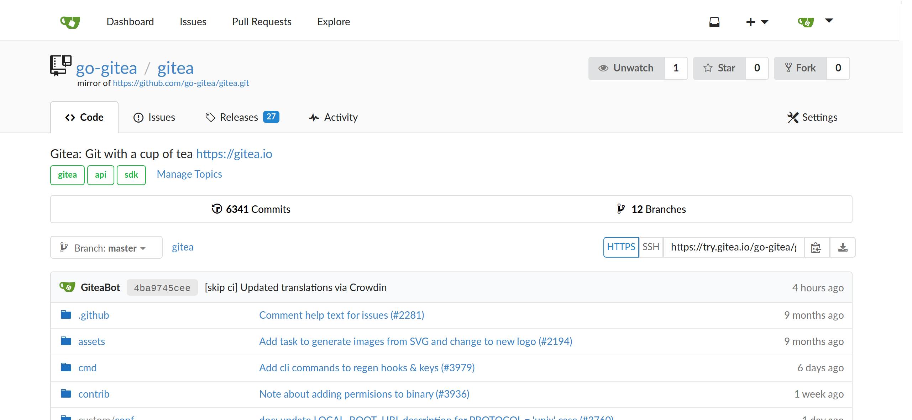

# Gitea

本页最后更新时间: {docsify-updated}

## 简介



## EXPOSE

| 端口 | 用途 |
| :--- | :--- |
| 22 | SSH |
| 3000 | 管理页面 |


## 前置准备

```bash
#创建数据保存目录
mkdir ${NFS}/gitea
```

## 启动命令

<!-- tabs:start -->
#### **Docker**
```bash
docker run -d \
--name gitea \
--restart unless-stopped \
--network=backend \
-v ${NFS}/gitea:/data \
-p 3000:3000 \
-p 8022:22 \
gitea/gitea
```


#### **Swarm**
```bash
docker service create --replicas 1 \
--name gitea \
--hostname gitea.mytrade.fun \
--network staging \
--mount type=bind,src=${NFS}/gitea,dst=/data \
--mount type=bind,src=/etc/timezone,dst=/etc/timezone:ro \
--mount type=bind,src=/etc/localtime,dst=/etc/localtime:ro \
-e DOMAIN="gitea.${DOMAIN}" \
-e SSH_DOMAIN="gitea.${DOMAIN}" \
-e SSH_PORT=8022 \
gitea/gitea

#traefik参数
--label traefik.enable=true \
--label traefik.docker.network=staging \
--label traefik.http.services.gitea.loadbalancer.server.port=3000 \
--label traefik.http.routers.gitea.rule="Host(\`gitea.${DOMAIN}\`)" \
--label traefik.http.routers.gitea.entrypoints=http \
--label traefik.http.routers.gitea-sec.tls=true \
--label traefik.http.routers.gitea-sec.tls.certresolver=dnsResolver \
--label traefik.http.routers.gitea-sec.rule="Host(\`gitea.${DOMAIN}\`)" \
--label traefik.http.routers.gitea-sec.entrypoints=https \
```



```
version: "3"

networks:
  gitea:
    external: false

services:
  server:
    image: gitea/gitea:1.15.3
    container_name: gitea
    environment:
      - USER_UID=1000
      - USER_GID=1000
      - GITEA__database__DB_TYPE=postgres
      - GITEA__database__HOST=db:5432
      - GITEA__database__NAME=gitea
      - GITEA__database__USER=gitea
      - GITEA__database__PASSWD=gitea
    restart: always
    networks:
      - gitea
    volumes:
      - ./gitea:/data
      - /etc/timezone:/etc/timezone:ro
      - /etc/localtime:/etc/localtime:ro
    ports:
      - "3000:3000"
      - "222:22"
     depends_on:
       - db
 
   db:
     image: postgres:13
     restart: always
     environment:
       - POSTGRES_USER=gitea
       - POSTGRES_PASSWORD=gitea
       - POSTGRES_DB=gitea
     networks:
       - gitea
     volumes:
       - ./postgres:/var/lib/postgresql/data

```

<!-- tabs:end -->

> 如从内网其它主机导入版本库不允许从私有IP导入，可通过在${NFS}/gitea/gitea/conf/app.ini中添加以下参数并重启解决

```text
[migrations]
ALLOW_LOCALNETWORKS = true
```

## OAuth2设置

> 到目前为止Gitea1.14.1与1.15-dev都无法正常使用OAuth2，报500错误

### NextCloud

设置&gt;安全&gt;OAuth 2.0 客户端

> 名称: Gitea
>
> 跳转URI: http://gitea.域名/user/oauth2/cloud/callback

保留客户端ID与密钥备用

### Gitea

管理后台&gt;认证源

> 认证类型: OAuth2
>
> 认证名称: cloud
>
> OAuth2 提供程序: NextCloud
>
> 客户端 ID与密钥: 来自刚保存的NextCloud参数
>
> 三个URL: 域名部分改为"cloud.你的域名"

 

## 参考

官网:  [https://gitea.io/zh-cn/](https://gitea.io/zh-cn/)  
配置说明: [https://docs.gitea.io/zh-cn/config-cheat-sheet/](https://docs.gitea.io/zh-cn/config-cheat-sheet/)

