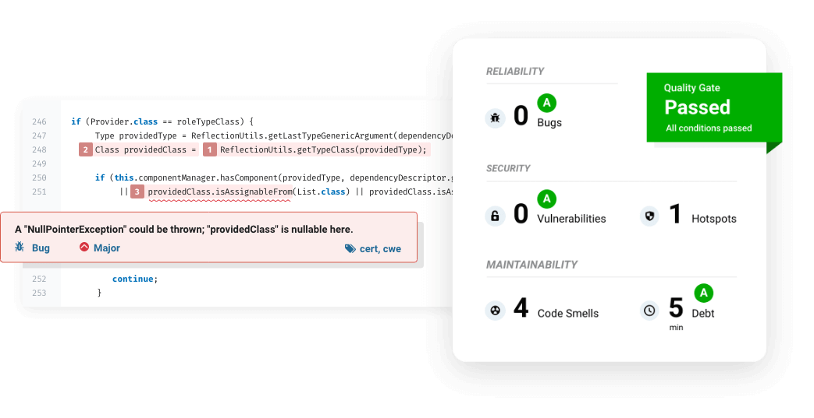

# SonarQube

本页最后更新时间: {docsify-updated}

[](https://github.com/SonarSource/sonarqube/releases/latest)

## 简介


SonarQube 是管理代码质量开放平台，有开源的社区版本和收费的开发者版本及企业版本，支持各种IDE和Jenkins等软件集成可审查多种编程语言，帮助你快速的定位代码中潜在的或者明显的错误。

SonarQube 不只是一个质量数据报告工具，更是代码质量管理平台。支持的语言包括：Java、PHP、C#、C、Cobol、PL/SQL、Flex 、JS/TS 等。
 主要特点：
 代码覆盖：通过单元测试，将会显示哪行代码被选中
 改善编码规则
 搜寻编码规则：按照名字，插件，激活级别和类别进行查询
 项目搜寻：按照项目的名字进行查询
 对比数据：比较同一张表中的任何测量的趋势

默认登录账号：admin 密码：admin


## EXPOSE

| 端口 | 用途 |
| :--- | :--- |
| 9000 | Web端口 |
| 9001 | Elasticsearch端口 |


## 前置准备

- 创建程序目录

```bash
mkdir -p ${NFS}/sonar/data
mkdir ${NFS}/sonar/logs
mkdir ${NFS}/sonar/extensions
```
- 修改kernel参数(为符合[Elasticsearch 生产模式要求](https://www.elastic.co/guide/en/elasticsearch/reference/current/docker.html#docker-cli-run-prod-mode))
```bash
sudo sysctl -w vm.max_map_count=524288
sudo sysctl -w fs.file-max=131072
ulimit -n 131072
ulimit -u 8192
```
- 部署**postgres**

- 在**prostgres**中创建`sonarqube`库

- 创建sonarqube用户并分配`sonarqube`库权限

 

## 启动命令

<!-- tabs:start -->
#### **Docker**

```bash
docker run -d \
--restart unless-stopped \
--name sonarqube \
--network=backend \
-e LANG="zh_CN.UTF-8" \
-e LANGUAGE='zh_CN:zh' \
-e LC_ALL='zh_CN.UTF-8' \
-e TZ=Asia/Shanghai \
-p 9000:9000 \
-e SONARQUBE_JDBC_URL=jdbc:postgresql://postgres:5432/sonarqube \
-e SONAR_JDBC_USERNAME=sonarqube \
-e SONAR_JDBC_PASSWORD={SONAR_SQL_PWD} \
-v ${NFS}/sonar/data:/opt/sonarqube/data \
-v ${NFS}/sonar/logs:/opt/sonarqube/logs \
-v ${NFS}/sonar/extensions:/opt/sonarqube/extensions \
sonarqube:10.4-community
```


#### **Swarm**

```bash
docker service create --replicas 1 \
--name sonarqube \
--network staging \
-e LANG="zh_CN.UTF-8" \
-e LANGUAGE='zh_CN:zh' \
-e LC_ALL='zh_CN.UTF-8' \
-e TZ=Asia/Shanghai \
-e SONARQUBE_JDBC_URL=jdbc:postgresql://postgres:5432/sonarqube \
-e SONAR_JDBC_USERNAME=sonarqube \
-e SONAR_JDBC_PASSWORD={SONAR_SQL_PWD} \
--mount type=bind,src=${NFS}/sonar/data,dst=/opt/sonarqube/data \
--mount type=bind,src=${NFS}/sonar/logs,dst=/opt/sonarqube/logs \
--mount type=bind,src=${NFS}/sonar/extensions,dst=/opt/sonarqube/extensions \
sonarqube:10.4-community

#traefik参数
--label traefik.enable=true \
--label traefik.docker.network=staging \
--label traefik.http.services.sonarqube.loadbalancer.server.port=9000 \
--label traefik.http.routers.sonarqube.rule="Host(\`sonarqube.${DOMAIN}\`)" \
--label traefik.http.routers.sonarqube.entrypoints=http \
--label traefik.http.routers.sonarqube-sec.tls=true \
--label traefik.http.routers.sonarqube-sec.tls.certresolver=dnsResolver \
--label traefik.http.routers.sonarqube-sec.rule="Host(\`sonarqube.${DOMAIN}\`)" \
--label traefik.http.routers.sonarqube-sec.entrypoints=https \
```


<!-- tabs:end -->


## 参考

官网: https://www.sonarqube.org/
Github: https://github.com/SonarSource/sonarqube

