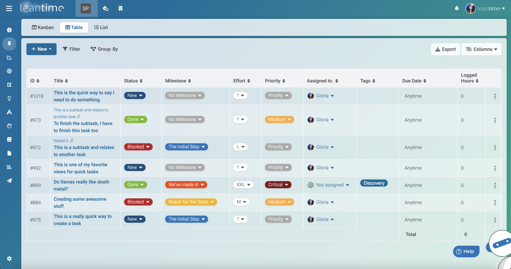

# Leantime

本页最后更新时间: {docsify-updated}

[](https://github.com/leantime/leantime/releases/latest)

## 简介




开源的项目管理软件，支持OIDC、LDAP登录，支持S3存储，提供API接口，集成看板和甘特图，无限子任务，定制标签，是TAPD的理想替代品


## EXPOSE

| 端口 | 用途 |
| :--- | :--- |
| 80 | 网站入口 |


## 前置准备

```bash
mkdir ${NFS}/leantime
wget -O ${NFS}/leantime/env https://raw.githubusercontent.com/Leantime/leantime/master/config/.env.demo
```


## 启动命令

<!-- tabs:start -->
#### **Docker**

```bash
docker run -d \
--restart unless-stopped \
--name leantime \
--network=backend \
-e TZ=Asia/Shanghai \
-e LEAN_DB_HOST=172.17.2.13 \
-e LEAN_DB_PORT=13049 \
-e LEAN_DB_USER=leantime \
-e LEAN_DB_PASSWORD=${MYSQL_PWD} \
-e LEAN_DB_DATABASE=leantime \
-e LEAN_EMAIL_RETURN=rakutens@hotmail.com \
-e LEAN_LANGUAGE=zh-cn
leantime/leantime:3.2.0
```


#### **Swarm**

```bash
docker service create --replicas 1 \
--name leantime \
--network staging \
-e TZ=Asia/Shanghai \
-e LEAN_DB_HOST=172.17.2.13 \
-e LEAN_DB_PORT=13049 \
-e LEAN_DB_USER=leantime \
-e LEAN_DB_PASSWORD=${MYSQL_PWD} \
-e LEAN_DB_DATABASE=leantime \
-e LEAN_EMAIL_RETURN=rakutens@hotmail.com \
-e LEAN_LANGUAGE=zh-cn
--label traefik.enable=true \
--label traefik.docker.network=staging \
--label traefik.http.services.leantime.loadbalancer.server.port=80 \
--label traefik.http.routers.leantime.tls=true \
--label traefik.http.routers.leantime.tls.certresolver=dnsResolver \
--label traefik.http.routers.leantime.rule="Host(\`task.${DOMAIN}\`)" \
--label traefik.http.routers.leantime.entrypoints=https \
leantime/leantime:3.2.0
```

<!-- tabs:end -->


## 参考

官网: https://leantime.io/
Github:https://github.com/Leantime/leantime

