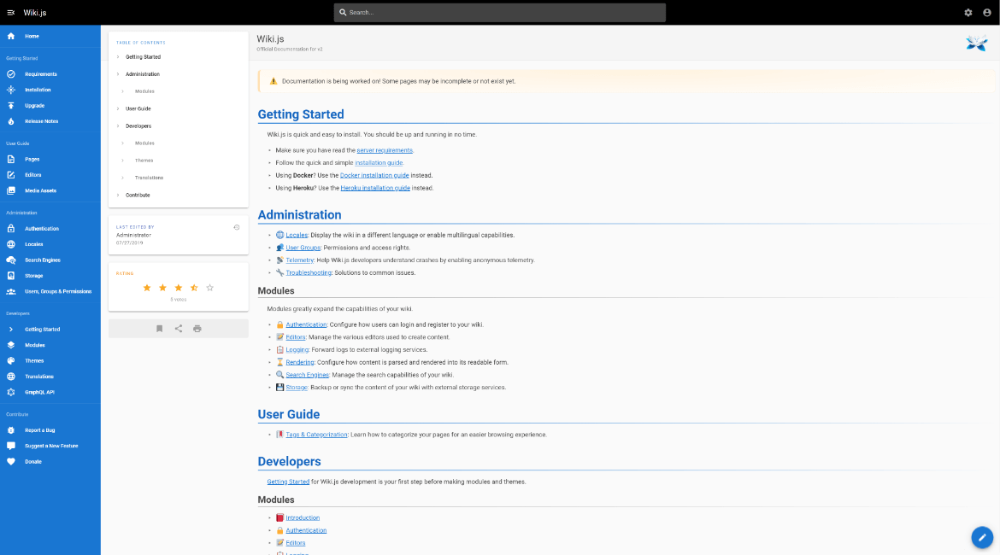

# Wiki.js

本页最后更新时间: {docsify-updated}

[](https://github.com/Requarks/wiki/releases/latest)

## 简介



轻量级Wiki，支持多种数据库，支持Markdown，支持国外社交软件认证，支持多种企业认证(LDAP、OIDC、OAuth2等)，支持高可用(仅支持PostgreSQL)，支持多种备份形式(本地、S3、Git、Google、Azure、Dropbox、SFTP等)


## EXPOSE

| 端口 | 用途 |
| :--- | :--- |
| 3000 | Http入口 |
| 3443 | Https入口 |


## 前置准备

```bash
mkdir -p ${NFS}/wikijs/data

# 创建secret作为数据库密码
echo `cat /dev/urandom | tr -dc A-Za-z0-9 | head -c 12` | docker secret create wikijs_db_pwd -

# 在数据库中创建wikijs库及wikijs用户，密码使用刚生成的secret值

# 下载配置文件
wget -O ${NFS}/wikijs/config.yaml https://raw.githubusercontent.com/requarks/wiki/main/config.sample.yml

#修改config文件中数据库相关内容
'强烈推荐使用Postgres，MySQL8.0以下版本仅支持部分功能'

```


## 启动命令

<!-- tabs:start -->

#### **Docker**

```bash
docker run -d \
--restart unless-stopped \
--name wikijs \
--network=backend \
-e TZ=Asia/Shanghai \
-p 3000:3000 \
--secret wikijs_db_pwd \
-e DB_PASS_FILE=/run/secrets/wikijs_db_pwd \
-v ${NFS}/wikijs/config.yml:/wiki/config.yml \
-v ${NFS}/wikijs/data/:/wiki/data/content \
requarks/wiki:2.5
```


#### **Swarm**

```bash
docker service create --replicas 1 \
--name wikijs \
--network staging \
-e TZ=Asia/Shanghai \
--secret wikijs_db_pwd \
-e DB_PASS_FILE=/run/secrets/wikijs_db_pwd \
--mount type=bind,src=${NFS}/wikijs/config.yml,dst=/wiki/config.yml \
--mount type=bind,src=${NFS}/wikijs/data/,dst=/wiki/data/content \
--label "traefik.enable=true" \
--label "traefik.docker.network=staging" \
--label "traefik.http.services.wikijs.loadbalancer.server.port=3000" \
--label "traefik.http.routers.wikijs.rule=Host(\`wiki.${DOMAIN}\`)" \
--label "traefik.http.routers.wikijs.entrypoints=http" \
--label "traefik.http.routers.wikijs-sec.tls=true" \
--label "traefik.http.routers.wikijs-sec.rule=Host(\`wiki.${DOMAIN}\`)" \
--label "traefik.http.routers.wikijs-sec.entrypoints=https" \
requarks/wiki:2.5
```

<!-- tabs:end -->


## 参考

官网: https://js.wiki
Github: https://github.com/Requarks/wiki
DockerHub: https://hub.docker.com/r/requarks/wiki
