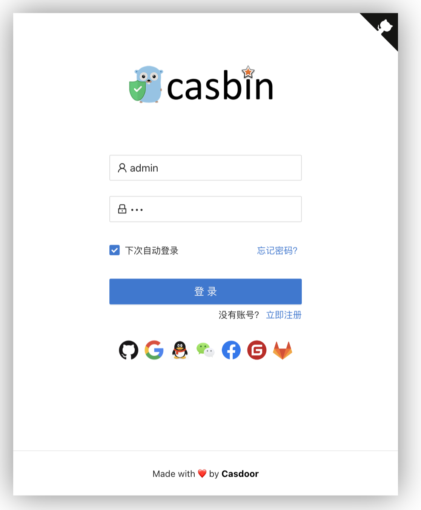

# Casdoor

本页最后更新时间: {docsify-updated}

[](https://github.com/casdoor/casdoor/releases/latest)

## 简介



开源单点登录(SSO)解决方案

## EXPOSE

| 端口 | 用途 |
| :--- | :--- |
| 8000 | 管理页面 |


## 前置准备

```bash
mkdir ${NFS}/casdoor
wget https://raw.githubusercontent.com/casdoor/casdoor/master/conf/app.conf
```


## 启动命令

<!-- tabs:start -->
#### **Docker**

```bash
docker run -d \
--restart unless-stopped \
--name oidc \
--network=backend \
-e TZ=Asia/Shanghai \
-e RUNNING_IN_DOCKER=true \
-v ${NFS}/casdoor/app.conf:/conf/app.conf \
casbin/casdoor:v1.80.0
```


#### **Swarm**

```bash
docker service create --replicas 1 \
--name oidc \
--network staging \
-e TZ=Asia/Shanghai \
-e RUNNING_IN_DOCKER=true \
--mount type=bind,src=${NFS}/casdoor/app.conf,dst=/conf/app.conf \
casbin/casdoor:v1.80.0

# traefik
--label traefik.enable=true \
--label traefik.docker.network=staging \
--label traefik.http.services.casdoor.loadbalancer.server.port=8000 \
--label traefik.http.routers.casdoor.rule="Host(\`oidc.${DOMAIN}\`)" \
--label traefik.http.routers.casdoor.entrypoints=http \
--label traefik.http.routers.casdoor-sec.tls=true \
--label traefik.http.routers.casdoor-sec.rule="Host(\`oidc.${DOMAIN}\`)" \
--label traefik.http.routers.casdoor-sec.entrypoints=https \

# loki
--log-driver=loki \
--log-opt loki-url="http://${SERVER_IP}:3100/loki/api/v1/push" \
```

<!-- tabs:end -->


## 参考

官网: https://casdoor.org/
Github: https://github.com/casdoor/casdoor

