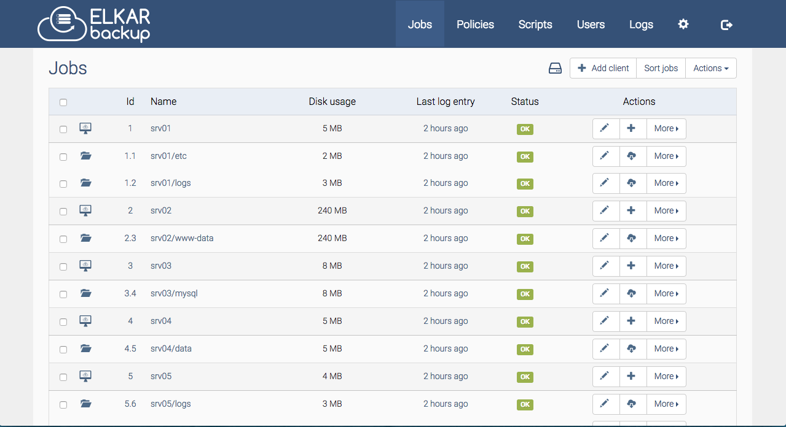

# Elkarbackup

本页最后更新时间: {docsify-updated}

[](https://github.com/elkarbackup/elkarbackup/releases/latest)

## 简介



基于RSync/RSnapshot的免费开源备份解决方案

### 功能特性

- 中心化管理备份

- 易于使用的web界面

- Linux/Windows客户端

- Pre-scripts 与 Post-scripts

- 多语言支持（英语、巴斯克语、西班牙语、德语、法语）

  


## EXPOSE

| 端口 | 用途 |
| :--- | :--- |
| 8000 | 管理页面 |


## 前置准备

```bash
mkdir -p ${NFS}/elkarbackup/backups #备份保存目录
mkdir ${NFS}/elkarbackup/script #脚本保存目录
mkdir ${NFS}/elkarbackup/sshkeys #SSH keys保存目录
```


## 启动命令

<!-- tabs:start -->
#### **Docker**

```bash
docker run -d \
--restart unless-stopped \
--name elkarbackup \
--network=backend \
-e TZ=Asia/Shanghai \
-e PHP_TZ=Asia/Shanghai \
-e SYMFONY__DATABASE__HOST=mysql \
-e SYMFONY__DATABASE__USER=="db-user" \
-e SYMFONY__DATABASE__PASSWORD="db-password" \
-e EB_CRON="enabled" \
-p 8000:8000 \
-v ${NFS}/elkarbackup/backups:/app/backups \
-v ${NFS}/elkarbackup/script:/app/uploads \
-v ${NFS}/elkarbackup/sshkeys:/app/.ssh \
elkarbackup/elkarbackup
```


#### **Swarm**

```bash
docker service create --replicas 1 \
--name elkarbackup \
--network staging \
-e TZ=Asia/Shanghai \
-e PHP_TZ=Asia/Shanghai \
-e SYMFONY__DATABASE__HOST=mysql \
-e SYMFONY__DATABASE__USER=="db-user" \
-e SYMFONY__DATABASE__PASSWORD="db-password" \
-e EB_CRON="enabled" \
--mount type=bind,src=${NFS}/elkarbackup/backups,dst=/app/backups \
--mount type=bind,src=${NFS}/elkarbackup/script,dst=/app/uploads \
--mount type=bind,src=${NFS}/elkarbackup/sshkeys,dst=/app/.ssh \
elkarbackup/elkarbackup

#traefik参数
--label traefik.enable=true \
--label traefik.docker.network=staging \
--label traefik.http.services.backup.loadbalancer.server.port=8000 \
--label traefik.http.routers.backup.rule="Host(\`backup.${DOMAIN}\`)" \
--label traefik.http.routers.backup.entrypoints=http \
--label traefik.http.routers.backup-sec.tls=true \
--label traefik.http.routers.backup-sec.tls.certresolver=dnsResolver \
--label traefik.http.routers.backup-sec.rule="Host(\`backup.${DOMAIN}\`)" \
--label traefik.http.routers.backup-sec.entrypoints=https \
```

<!-- tabs:end -->

## 环境变量

The following environment variables are also honored for configuring your ElkarBackup instance:

### 常规

| name    | default value | description                   |
| ------- | ------------- | ----------------------------- |
| TZ      | Europe/Paris  | Timezone                      |
| PHP_TZ  | Europe/Paris  | Timezone (PHP)                |
| EB_CRON | enabled       | run tick command periodically |

### 数据库配置

| name                        | default value | description      |
| --------------------------- | ------------- | ---------------- |
| SYMFONY__DATABASE__DRIVER   | pdo_mysql     | driver           |
| SYMFONY__DATABASE__PATH     | null          | db path (sqlite) |
| SYMFONY__DATABASE__HOST     | db            | db host          |
| SYMFONY__DATABASE__PORT     | 3306          | db port          |
| SYMFONY__DATABASE__NAME     | elkarbackup   | db name          |
| SYMFONY__DATABASE__USER     | root          | db user          |
| SYMFONY__DATABASE__PASSWORD | root          | db password      |

### 邮件配置

| name                       | default value | description  |
| -------------------------- | ------------- | ------------ |
| SYMFONY__MAILER__TRANSPORT | smtp          | transport    |
| SYMFONY__MAILER__HOST      | localhost     | host         |
| SYMFONY__MAILER__USER      | null          | user         |
| SYMFONY__MAILER__PASSWORD  | null          | password     |
| SYMFONY__MAILER__FROM      | null          | from address |

### Elkarbackup配置

| name                             | default value                  | description                         |
| -------------------------------- | ------------------------------ | ----------------------------------- |
| SYMFONY__EB__SECRET              | random value will be generated | framework secret                    |
| SYMFONY__EB__UPLOAD__DIR         | /app/uploads                   | scripts directory                   |
| SYMFONY__EB__BACKUP__DIR         | /app/backups                   | backups directory                   |
| SYMFONY__EB__TMP__DIR            | /app/tmp                       | tmp directory                       |
| SYMFONY__EB__URL__PREFIX         | null                           | url path prefix (i.e. /elkarbackup) |
| SYMFONY__EB__PUBLIC__KEY         | /app/.ssh/id_rsa.pub           | ssh public key path                 |
| SYMFONY__EB__MAX__PARALLEL__JOBS | 1                              | max parallel jobs                   |
| SYMFONY__EB__POST__ON__PRE__FAIL | true                           | post on pre fail                    |


## 参考

官网: https://www.elkarbackup.org
Github: https://github.com/elkarbackup/elkarbackup
