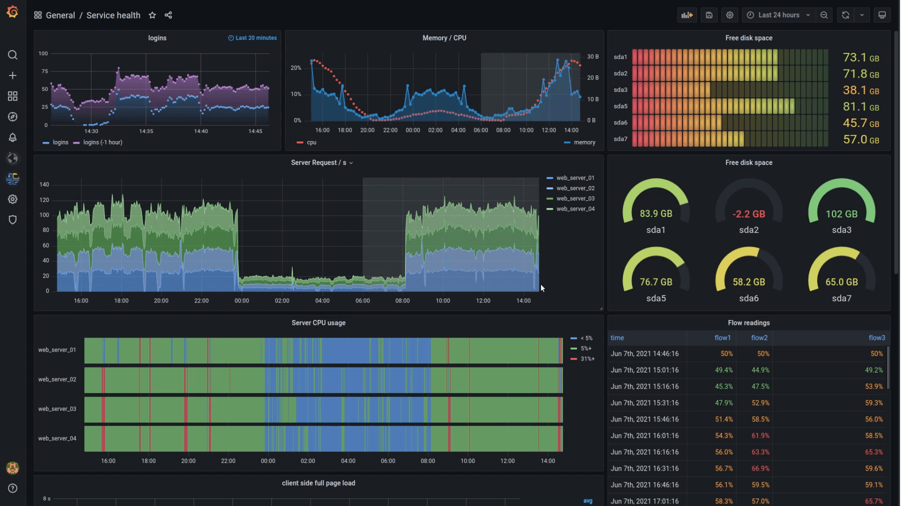

# Grafana

本页最后更新时间: {docsify-updated}

[](https://github.com/grafana/grafana/releases/latest)

## 简介

数据可视化工具


## EXPOSE

| 端口 | 用途 |
| :--- | :--- |
| 3000 | 管理页面 |


## 前置准备

```bash
#创建数据保存目录
mkdir ${NFS}/grafana

chmod 777 

wget -O ${NFS}/grafana/grafana.ini https://raw.githubusercontent.com/grafana/grafana/main/conf/sample.ini
wget -O ${NFS}/grafana/datasources.yaml https://github.com/grafana/tempo/blob/main/example/docker-compose/loki/grafana-datasources.yaml
```

## 启动命令

<!-- tabs:start -->
#### **Docker**
```bash
docker run -d \
--name grafana \
--restart always \
--net backend \
-p 3000:3000 \
-e "GF_INSTALL_PLUGINS=grafana-clock-panel,grafana-piechart-panel,grafana-simple-json-datasource,grafana-azure-monitor-datasource" \
-e "GF_SECURITY_ADMIN_PASSWORD=P@ssw0rd123" \
-v ${NFS}/grafana:/var/lib/grafana \
grafana/grafana
```


#### **Swarm**
```bash
docker service create --replicas 1 \
--name grafana \
--network staging \
-e TZ=Asia/Shanghai \
-e "GF_INSTALL_PLUGINS=grafana-clock-panel,grafana-piechart-panel,grafana-simple-json-datasource" \
-e "GF_SECURITY_ADMIN_PASSWORD=P@ssw0rd123" \
--mount type=bind,src=${NFS}/grafana,dst=/var/lib/grafana \
grafana/grafana

#traefik参数
--label traefik.enable=true \
--label traefik.docker.network=staging \
--label traefik.http.services.grafana.loadbalancer.server.port=3000 \
--label traefik.http.routers.grafana.rule="Host(\`grafana.${DOMAIN}\`)" \
--label traefik.http.routers.grafana.entrypoints=http \
--label traefik.http.routers.grafana-sec.tls=true \
--label traefik.http.routers.grafana-sec.tls.certresolver=dnsResolver \
--label traefik.http.routers.grafana-sec.rule="Host(\`grafana.${DOMAIN}\`)" \
--label traefik.http.routers.grafana-sec.entrypoints=https \
```

<!-- tabs:end -->


## 参考

面板:[Grafana Loki Dashboard for NGINX Service Mesh](https://grafana.com/grafana/dashboards/12559)  
报错:[https://www.cnblogs.com/alisapine/p/15080982.html](https://www.cnblogs.com/alisapine/p/15080982.html)

