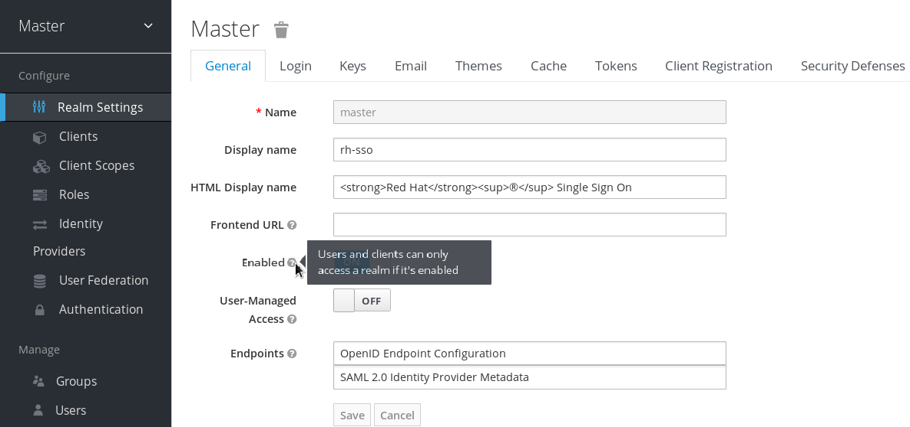

# Keycloak 
本页最后更新时间: {docsify-updated}

[](https://github.com/keycloak/keycloak/releases/latest)


## 简介

身份和访问管理解决方案



## EXPOSE

| 端口 | 用途 |
| :--- | :--- |
| 8080 | 管理页面 |


## 启动命令

<!-- tabs:start -->
#### **Docker**
```bash
docker run -d\
--restart unless-stopped \
--network=backend \
--name keycloak \
-h jumpserver \
-p 8080:8080 \
-e KEYCLOAK_USER=admin \
-e KEYCLOAK_PASSWORD=admin \
jboss/keycloak
```


#### **Swarm**
```bash
docker service create --replicas 1 \
--network staging \
-e TZ=Asia/Shanghai \
--name keycloak \
-e KEYCLOAK_USER=admin \
-e KEYCLOAK_PASSWORD=admin \
jboss/keycloak

#traefik参数
--label traefik.enable=true \
--label traefik.docker.network=staging \
--label traefik.http.services.keycloak.loadbalancer.server.port=8080 \
--label traefik.http.routers.keycloak.rule="Host(\`keycloak.${DOMAIN}\`)" \
--label traefik.http.routers.keycloak.entrypoints=http \
--label traefik.http.routers.keycloak-sec.tls=true \
--label traefik.http.routers.keycloak-sec.tls.certresolver=dnsResolver \
--label traefik.http.routers.keycloak-sec.rule="Host(\`keycloak.${DOMAIN}\`)" \
--label traefik.http.routers.keycloak-sec.entrypoints=https \
```

<!-- tabs:end -->


## 参考

