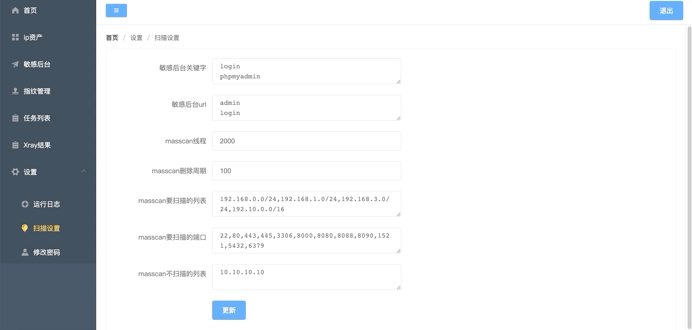

# Linglong

本页最后更新时间: {docsify-updated}

## 简介



一款资产巡航扫描系统。系统定位是通过masscan+nmap无限循环去发现新增资产，自动进行端口弱口令爆破/、指纹识别、XrayPoc扫描。主要功能包括: `资产探测`、`端口爆破`、`Poc扫描`、`指纹识别`、`定时任务`、`管理后台识别`、`报表展示`。 使用场景是Docker搭建好之后，设置好你要扫描的网段跟爆破任务。就不要管他了，没事过来收漏洞就行了

### 功能清单

-  masscan+namp巡航扫描资产
-  创建定时爆破任务(FTP/SSH/SMB/MSSQL/MYSQL/POSTGRESQL/MONGOD)
-  管理后台识别
-  结果导出
-  报表展示
-  CMS识别 - 结合威胁情报、如果某个CMS爆出漏洞，可以快速定位企业内部有多少资产 [21-02-20]
-  poc扫描 - 调用xray的Poc,对新发现的资产自动扫描poc [21-02-20]


## EXPOSE

| 端口 | 用途 |
| :--- | :--- |
| 18000 | DNS |
| 8001 | Web页面 |


## 前置准备

```bash
mkdir ${NFS}/linglong
chmod 775 ${NFS}/linglong
#下载项目源码
wget -O linglong.zip https://github.com/awake1t/linglong/archive/refs/heads/master.zip
unzip linglong.zip
#生成服务端镜像
docker build -t linglong-server .
#生成网页端镜像
docker build -f web/Dockerfile linglong-web web/
```


## 启动命令

<!-- tabs:start -->
#### **Docker**

```bash
docker run -d \
--restart unless-stopped \
--name elkarbackup \
--network=backend \
-e TZ=Asia/Shanghai \

```


#### **Swarm**

```bash
docker service create --replicas 1 \
--name elkarbackup \
--network staging \
-e TZ=Asia/Shanghai \
```

<!-- tabs:end -->


## 参考

官网: 
Github:

