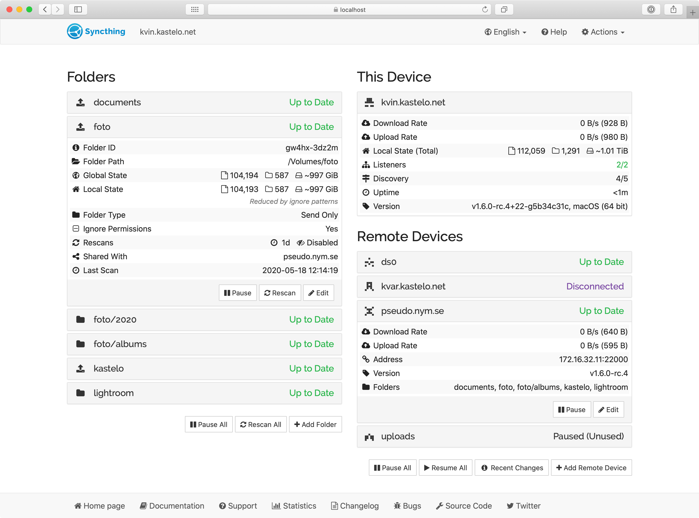

# Syncthing

本页最后更新时间: {docsify-updated}

[](https://github.com/syncthing/syncthing/releases/latest)

## 简介



开源的P2P同步软件，如果你有大量数据需要同步到多台服务器上，使用它是非常不错的选择。

## EXPOSE

| 端口 | 用途 |
| :--- | :--- |
| 8384 | Web管理页面 |
| 22000/tcp | 通讯端口 |
| 22000/udp | 通讯端口 |


## 前置准备

```bash
mkdir ${NFS}/syncthing
```


## 启动命令

<!-- tabs:start -->
#### **Docker**

```bash
docker run -d \
--name syncthing \
--restart unless-stopped \
-e TZ=Asia/Shanghai \
-p 8384:8384 \
-p 22000:22000/tcp \
-p 22000:22000/udp \
-v ${NFS}/syncthing:/var/syncthing \
syncthing/syncthing:latest
```


#### **Swarm**

```bash
docker service create --replicas 1 \
--name syncthing \
--network staging \
-e TZ=Asia/Shanghai \
--publish published=8384,target=8384,mode=host \
--publish published=22000,target=22000,mode=host,protocol=tcp \
--publish published=22000,target=22000,mode=host,protocol=udp \
--mount type=bind,src=${NFS}/syncthing,dst=/var/syncthing \
syncthing/syncthing:latest

#traefik参数
--label "traefik.enable=true"
--label "traefik.docker.network=traefik"
--label "traefik.http.services.sync.loadbalancer.server.scheme=http"
--label "traefik.http.services.sync.loadbalancer.server.port=8384"
--label "traefik.http.routers.sync-http.entrypoints=http"
--label "traefik.http.routers.sync-http.rule=Host(`sync.${DOMAIN}`)"
--label "traefik.http.routers.sync-http.service=sync"
--label "traefik.http.routers.sync-https.entrypoints=https"
--label "traefik.http.routers.sync-https.tls=true"
--label "traefik.http.routers.sync-https.rule=Host(`sync.${DOMAIN}`)"
--label "traefik.http.routers.sync-https.service=sync"
```


#### **Compose**

```yaml
version: "3"
services:
  syncthing:
    image: syncthing/syncthing
    container_name: syncthing
    hostname: syncthing
    environment:
      - PUID=1000
      - PGID=1000
    volumes:
      - ${NFS}/syncthing:/var/syncthing
    labels:
      - "traefik.enable=true"
      - "traefik.docker.network=traefik"
      - "traefik.http.services.sync.loadbalancer.server.scheme=http"
      - "traefik.http.services.sync.loadbalancer.server.port=8384"
      - "traefik.http.routers.sync-http.entrypoints=http"
      - "traefik.http.routers.sync-http.rule=Host(`sync.${DOMAIN}`)"
      - "traefik.http.routers.sync-http.service=sync"
      - "traefik.http.routers.sync-https.entrypoints=https"
      - "traefik.http.routers.sync-https.tls=true"
      - "traefik.http.routers.sync-https.rule=Host(`sync.${DOMAIN}`)"
      - "traefik.http.routers.sync-https.service=sync"
    ports:
      - target: 8384
        published: 8384
        protocol: tcp
        mode: host
      - target: 22000
        published: 22000
        protocol: tcp
        mode: host
      - target: 22000
        published: 22000
        protocol: udp
        mode: host
    restart: unless-stopped
```


<!-- tabs:end -->


## 参考

官网: https://www.syncthing.net/
