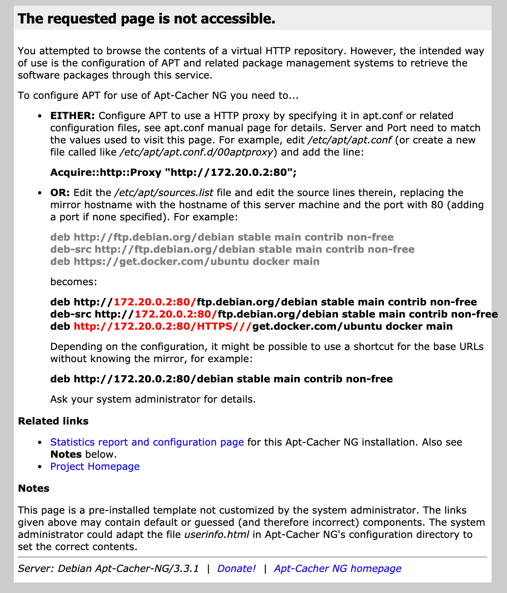

# Apt-Cacher NG

本页最后更新时间: {docsify-updated}

## 简介

系统源缓存服务



## EXPOSE

| 端口 | 用途 |
| :--- | :--- |
| 3142 | 管理页面 |


## 前置准备

```bash
mkdir -p ${NFS}/acng/data
mkdir ${NFS}/acng/logs
```

## 启动命令

<!-- tabs:start -->
#### **Docker**
```bash
docker run -d \
--restart unless-stopped \
--network=backend \
--name acng \
-e TZ=Asia/Shanghai \
-p 3142:3142 \
-v ${NFS}/acng/data:/var/cache/apt-cacher-ng \
-v ${NFS}/acng/logs:/var/log/apt-cacher-ng \
--label traefik.enable=false \
sameersbn/apt-cacher-ng
```


#### **Swarm**
```bash
docker service create --replicas 1 \
--name acng \
--network staging \
-e TZ=Asia/Shanghai \
-p 3142:3142 \
--mount type=bind,src=${NFS}/acng/data,dst=/var/cache/apt-cacher-ng \
--mount type=bind,src=${NFS}/acng/logs,dst=/var/log/apt-cacher-ng \
--label traefik.enable=false \
sameersbn/apt-cacher-ng
```

<!-- tabs:end -->

* 测试

```text
wget -e "http_proxy=服务器IP:3142" http://dl-cdn.alpinelinux.org/alpine/v3.14/main/x86_64/APKINDEX.tar.gz
```


* 使用方法 [https://docs.docker.com/samples/apt-cacher-ng/](https://docs.docker.com/samples/apt-cacher-ng/)

## 参考

官网: [https://www.unix-ag.uni-kl.de/~bloch/acng/](https://www.unix-ag.uni-kl.de/~bloch/acng/)

