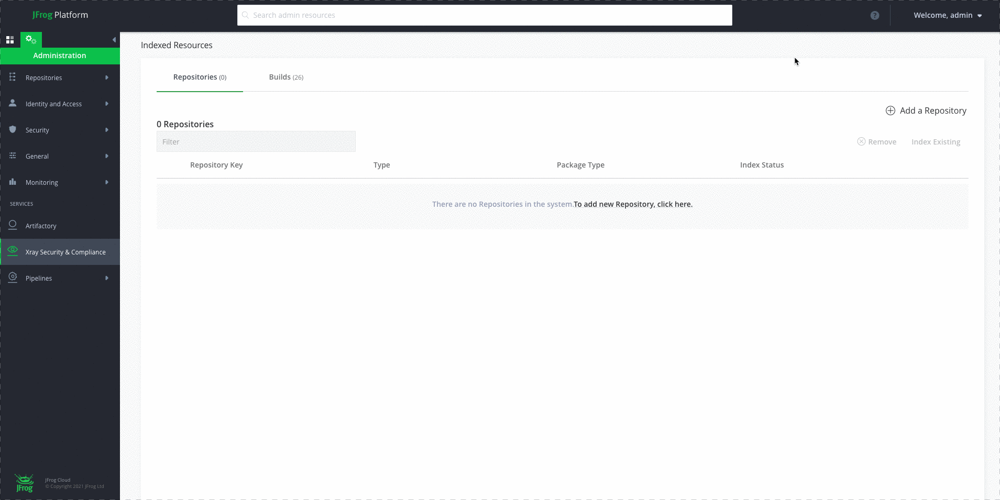

# Artifactory

本页最后更新时间: {docsify-updated}

## 简介



Nexus3的竞品，功能更强大一些\([与其它产品的对比](https://www.eficode.com/blog/artifactory-nexus-proget)\)，而且虽然镜像文件比Nexus3大300M，但初始运行内存只有1.4G，反而比Nexus3少300M

默认用户: admin
密码: password

## EXPOSE

| 端口 | 用途 |
| :--- | :--- |
| 8081 |  |
| 8082 |  |

## 前置准备

```bash
#创建数据保存目录
sudo mkdir $NFS/artifactory
sudo chmod -R 777 $NFS/artifactory
```

## 启动命令

<!-- tabs:start -->
#### **Docker**
```bash
docker run -d \
--restart unless-stopped \
--network=backend \
--name artifactory  \
-p 8081:8081 -p 8082:8082 \
-v $NFS/artifactory:/var/opt/jfrog/artifactory \
docker.bintray.io/jfrog/artifactory-oss:latest
```


#### **Swarm**


<!-- tabs:end -->


## 参考

官网: [https://www.jfrog.com/confluence/display/JFROG/JFrog+Artifactory](https://www.jfrog.com/confluence/display/JFROG/JFrog+Artifactory)

