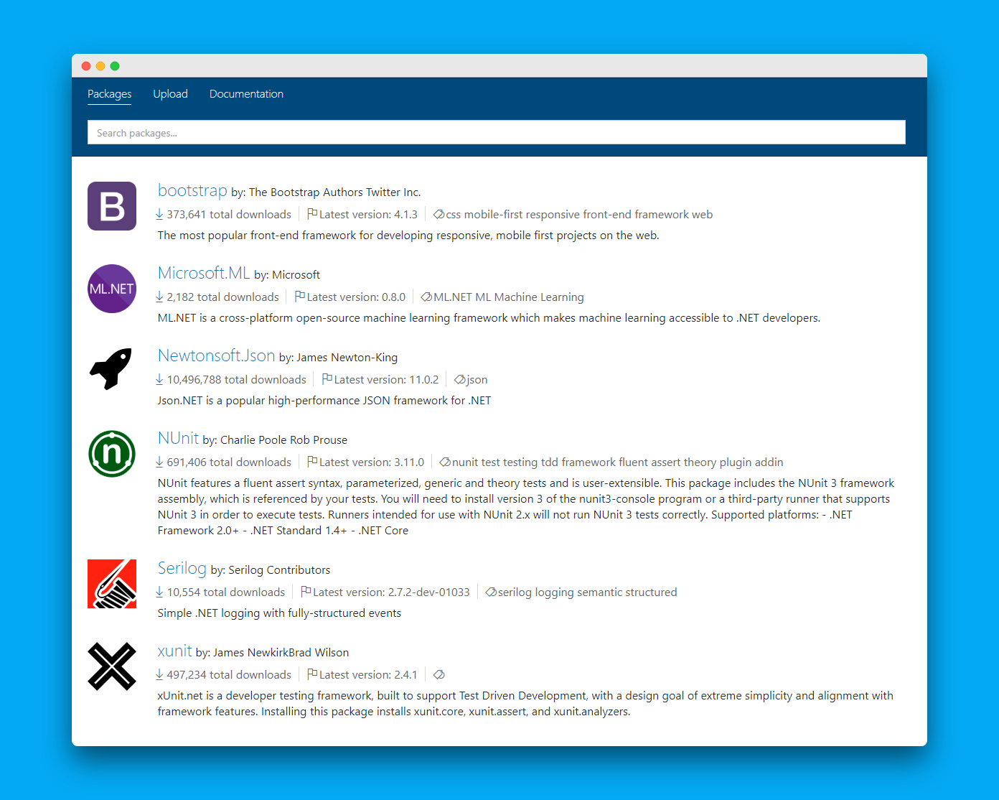

# BaGet

本页最后更新时间: {docsify-updated}

## 简介

NuGet私有仓库



BaGet \(pronounced "baguette"\) is a lightweight NuGet and symbol server. It is open source, cross-platform, and cloud ready!

## EXPOSE

| 端口 | 用途 |
| :--- | :--- |
| 80 | HTTP端口 |

## 前置准备

```bash
mkdir -p ${NFS}/baget/data

```

* 创建环境变量文件`baget.env`

```text
# The following config is the API Key used to publish packages.
# You should change this to a secret value to secure your server.
ApiKey=NUGET-SERVER-API-KEY

Storage__Type=FileSystem
Storage__Path=/var/baget/packages
Database__Type=Sqlite
Database__ConnectionString=Data Source=/var/baget/baget.db
Search__Type=Database
```

## 启动命令

<!-- tabs:start -->
#### **Docker**
```bash
docker run --rm \
--name nuget-server \
-p 5555:80 \
--env-file ${NFS}/baget/baget.env \
-v ${NFS}/baget/data:/var/baget \
loicsharma/baget:latest
```


#### **Swarm**


<!-- tabs:end -->

* 在 `工具/选项/Nuget包管理器/程序包源` 中增加私有nuget服务地址 http://ip:port/v3/index.json

## 参考

Github: [https://github.com/loic-sharma/BaGet](https://github.com/loic-sharma/BaGet)  
官方文档: [https://loic-sharma.github.io/BaGet/](https://loic-sharma.github.io/BaGet/)

