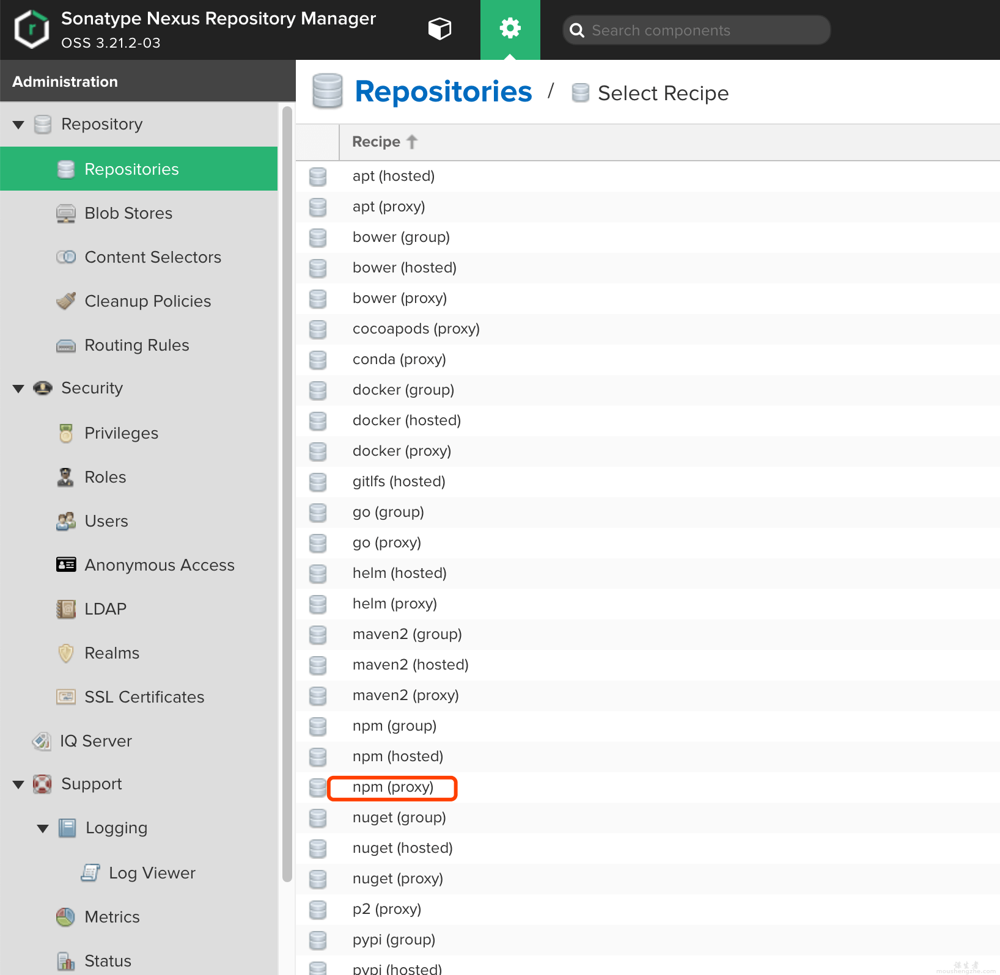

# Nexus3

本页最后更新时间: {docsify-updated}

## 简介



Nexus3是目前比较流行的仓库管理器，3.27版本开始Groups Push功能仅在Pro版中提供，付费的话约需3000美金左右，所以我们还是以使用3.26版为主。

## EXPOSE

| 端口 | 用途 |
| :--- | :--- |
| 8081 | 管理页面 |
| 8082 | PULL端口 |
| 8083 | PUSH端口 |


## 前置准备

```bash
#创建数据保存目录
mkdir ${NFS}/nexus
chmod -R 777 $NFS/nexus
```

## 启动命令

<!-- tabs:start -->
#### **Docker**
```bash
docker run -d \
--restart unless-stopped \
--network=backend \
--name nexus \
-p 8081:8081 \
-p 8082:8082 \
-p 8083:8083 \
-v $NFS/nexus:/nexus-data \
sonatype/nexus3:3.26.1

#获取admin密码
docker exec nexus cat /nexus-data/admin.password
#87c662d4-4ae8-469d-9dbe-070b252f568f
```


#### **Swarm**


<!-- tabs:end -->


## 参考

