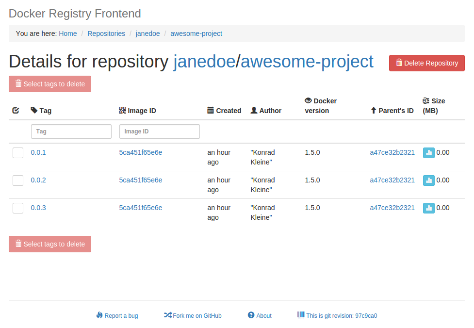

# Registry

本页最后更新时间: {docsify-updated}

## 简介

Docker仓库



## EXPOSE

| 端口 | 用途 |
| :--- | :--- |
| 5000 | 通讯端口 |


## 前置准备

```bash
#创建数据保存目录
mkdir ${NFS}/registry
chmod -R 766 $NFS/registry
```

## 启动命令

<!-- tabs:start -->
#### **Docker**
```bash
docker run -d \
--name registry \
--restart unless-stopped \
-e TZ=Asia/Shanghai \
-p 5000:5000 \
-v ${NFS}/registry:/var/lib/registry \
registry
```

#### **Swarm**

```bash
docker service create --replicas 1 \
--name registry \
--network staging \
-p 5000:5000 \
-e TZ=Asia/Shanghai \
--mount type=bind,src=$NFS/registry,dst=/var/lib/registry \
--label traefik.enable=false \
registry
```


<!-- tabs:end -->

* WEB界面\(可选\)

```bash
docker run -d \
--name registry-web \
--restart unless-stopped \
-e TZ=Asia/Shanghai \
-e ENV_DOCKER_REGISTRY_HOST=ENTER-YOUR-REGISTRY-HOST-HERE \
-e ENV_DOCKER_REGISTRY_PORT=ENTER-PORT-TO-YOUR-REGISTRY-HOST-HERE \
-p 80:80 \
konradkleine/docker-registry-frontend:v2
```

## 参考

