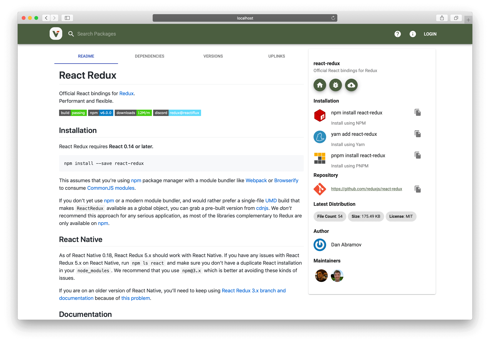

# Verdaccio

本页最后更新时间: {docsify-updated}

## 简介

NPM仓库



## EXPOSE

| 端口 | 用途 |
| :--- | :--- |
| 4873 | 管理页面 |


## 前置准备

```bash
#创建数据保存目录
mkdir $NFS/verdaccio
chmod 777 $NFS/verdaccio
```

## 启动命令

<!-- tabs:start -->
#### **Docker**
```bash
docker run -d \
--restart unless-stopped \
--network=backend \
--name verdaccio \
-p 4873:4873 \
-v $NFS/verdaccio:/verdaccio/storage \
verdaccio/verdaccio
```


#### **Swarm**
```bash
docker service create --replicas 1 \
--name verdaccio \
--network staging \
-e TZ=Asia/Shanghai \
-p 4873:4873 \
--mount type=bind,src=${NFS}/verdaccio,dst=/verdaccio/storage \
--label traefik.enable=false \
verdaccio/verdaccio
```

<!-- tabs:end -->


## 参考


